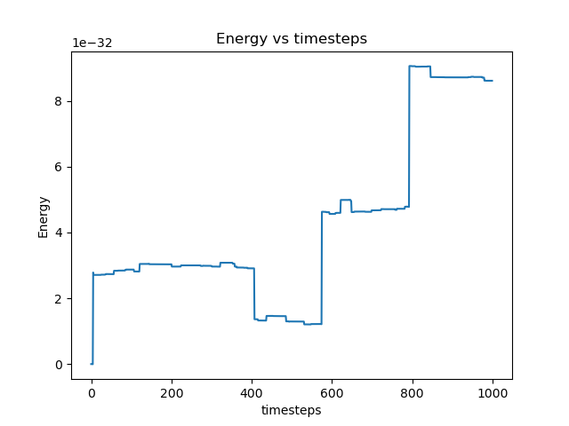
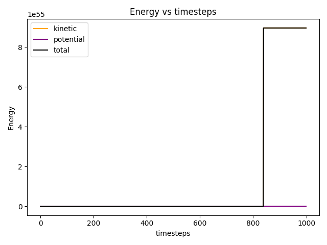
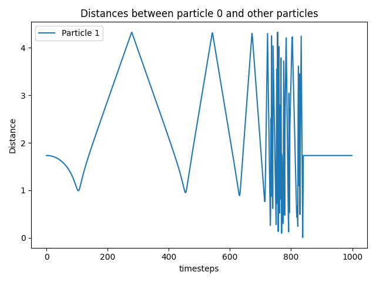
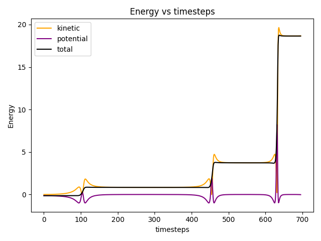
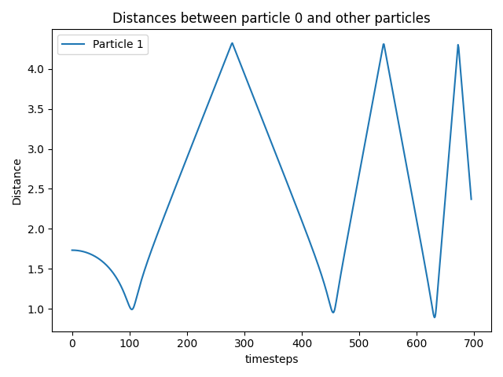
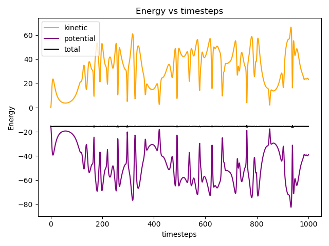
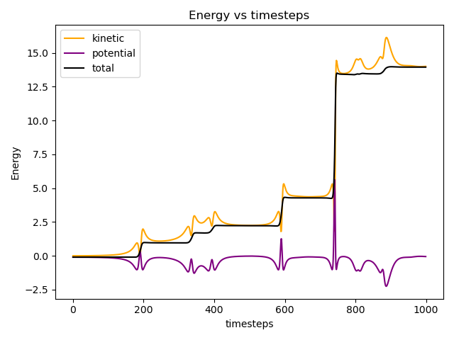
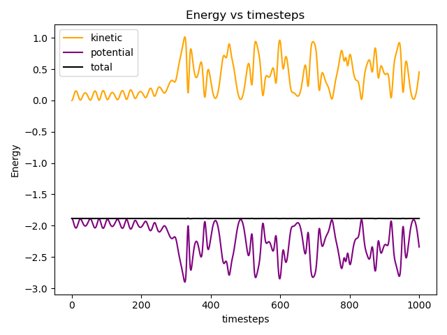
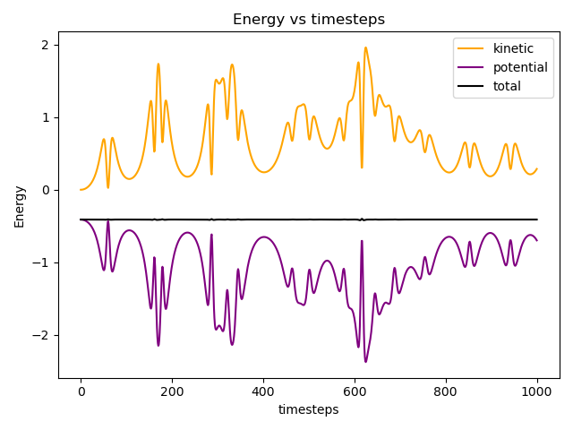

# Weekly progress journal

## Instructions

In this journal you will document your progress of the project, making use of the weekly milestones.

Every week you should 

1. write down **on the day of the lecture** a short plan of how you want to 
   reach the weekly milestones. Try to be specific: Think about how to distribute work in the group, 
   what pieces of code functionality need to be implemented, and set target deadlines.
2. write about your progress **until Tuesday, 11:00** before the next lecture with respect to the milestones.
   Substantiate your progress with links to code, pictures or test results. Reflect on the
   relation to your original plan.

We will give feedback on your progress on Tuesday before the following lecture. Consult the 
[grading scheme](https://computationalphysics.quantumtinkerer.tudelft.nl/proj1-moldyn-grading/) 
for details how the journal enters your grade.

In week 3, we ask you additionally to use the [team checklist](https://compphys.quantumtinkerer.tudelft.nl/planning_project/#team-checklist)
to reflect on how the group work is going, and how you could improve in the future.
(Note that the grade of that week does not depend on how the group functions - but we 
can give you feedback that helps you!)

Note that the file format of the journal is *markdown*. This is a flexible and easy method of 
converting text to HTML. 
Documentation of the syntax of markdown can be found 
[here](https://docs.gitlab.com/ee/user/markdown.html#gfm-extends-standard-markdown). 
You will find how to include [links](https://docs.gitlab.com/ee/user/markdown.html#links) and 
[images](https://docs.gitlab.com/ee/user/markdown.html#images) particularly
useful.

## Week 1
(due 18 February 2025, 11:00)

#### Planning

Our group wasn't complete yet so we didn't make a planning.
Instead two of us looked at the milestones for the week and made sure to understand them.
We then created gitlab issues (#2, #3, #4, #6, #8, #11 and #12) and a [milestone](https://gitlab.kwant-project.org/computational_physics/projects/Project1_mankritsingh_npaarts_rjuyal/-/milestones/5)
to keep track of the progress and worked on them when we had time.

#### Progress report

- After creating the issues, we created branches to solve those issues and then merged them after review. 
- We first stored each particle's position and velocity at every timestep(see issue #2) using lists of numpy arrays. 
- We then created a function to calculate relative positions and distances taking into account for periodic boundary(see issues #6 and #11). This was done by creating a box with the ith particle at the centre and taking modulo to get the relative position(and thus the distance) of the jth particle. 
- We then implemented the Euler method for time evolution(see issue #3) making sure to keep the periodic boundary on the position.
- Then the total potential energy function was created(see issue #8) and after that we created the function to calculate the force(see issue #4).
- Finally we added functions for total kinetic energy, total energy, plot of total energy vs timestep and rendering the animation of the particles(see issue #12).
- Currently the animation seems incorrect but this may be due to incorrect scales.

The energies have short periods of being stable but large jumps in between as can be seen in

When we look at the particles moving around in the box we can understand at least the first jump

## Week 2
(due 25 February 2025, 11:00)

#### Planning
This week @mankritsingh will work on making the code dimensionless, @npaarts will work on quality of life improvements like making it easier to debug, creating a config file, etc, and @rjuyal will do the simulation of 2 atoms. Since we have already implemented the minimal image convention in !4, we don't need to work on that this week. We aim to finish this by Monday(24 Feb) afternoon so that we can discuss and make final touch ups.

#### Progress report

Noa: 
The past week I've been quite busy, so I haven't been able to do too much for the project.
I knew this already so communicated this with Ragi and Mankrit.
I've mostly worked on adding simple configuration options in !15 and adding
a "debug print" called `dprint` which is only active when the `DEBUG` environment variable is set in !10.
Today I started working on the Velocity-Verlet algorithm for week 3 (!14), it's promising but not
fully finished yet.
The default config file can be found at [config.json](https://gitlab.kwant-project.org/computational_physics/projects/Project1_mankritsingh_npaarts_rjuyal/-/blob/fe080d06ddf6b28be85417bc0444849c9d27821b/config.json).

@mankritsingh:
Derived the dimensionless units for kinetic energy\
Made the code dimensionless in Merge Request !11\
Reviewed other Merge Requests.

Derivation for dimensionless units can be found here:\

@rjuyal: (see !13)
- Added function to plot distances
- Changed values of parameters like initial position, timestep to produce animation of 2 particles in 3D 

Energies: \
 \
Distances: \
 \
Animation: \
 
- We assume that this sudden jump is due to the Euler method not conserving the total energy and will be fixed by the velocity-verlet algorithm.
- We had already added code for minimal image convention(see !4) and code to plot kinetic and potential energy along with total energy(see !9).

Plots before the sudden blow up: \
Energies: \
 \
Distances: \
 \
Animation: \

## Week 3
(due 4 March 2025, 11:00)

#### Planning
- Extend code to more than 2 particles - Done in Week 1
- Implement Velocity Verlet - In Progress since Week 2 by @npaarts
- Energy plots of total, kinetic and potential energies - Done in Week 1
- Structure Code properly
   - Move initialization to separate file, debug print should be in utilities - @npaarts
   - Different simulators in one file, plotting in another file, input as config - @rjuyal
- Compare and Plot energies for Euler and Velocity Verlet - @mankritsingh
- Implement Leapfrog and compare with others (if we have time) - @mankritsingh

We aim to finish this by Monday (3rd March) afternoon so that we can discuss and make final touch ups.

#### Progress report

@npaarts:
I've finished up the start I made in week 2 for the velocity verlet algorithm.
I knew it was working when the two particle situation that blew up before looked more realistic.  

The old integrator (euler):  

The new integrator (verlet):  

It also works well for 27 particles spread around in a grid:  

And we can also look at the energy in this last case  

After finishing the integrator I worked on moving the different initialisation types we had for
positions and velocities to a [seperate file](https://gitlab.kwant-project.org/computational_physics/projects/Project1_mankritsingh_npaarts_rjuyal/-/blob/c57fb91294779c319eaa5cec6391c78a46fb9171/initialisation.py).
Where I gave the different methods explanations and organised them slightly.
I also improved the config file we had `config.json`, this file can now contain 
the name of the initialisation method to use that method for both positions and velocities.

Finally I improved the defaults in the config (a7928307b8a0f8d85b5a2afce5d7670cf7e054f4) so the simulation doesn't instantly explode due
to the particles starting too close together.

@mankritsingh
I've added and tested the leapfrog integrator in Merge Request: !21 
Also did some refactoring for the code, moving the code to a common folder and renamed "skeleton.py" in Merge Request: !22
Reviewed Merge Requests/code.

Sharing the results of energy conservation below for 3 particles:

Euler:

Velocity-Verlet:

Leapfrog:

We observe that the total energy is conserved for Velocity Verlet and Leapfrog integrators but not for Eurler integrator as expected.

#### Reflection on group work

## Week 4
(due 11 March 2025, 11:00)

#### Planning

#### Progress report

## Week 5
(due 18 March 2025, 11:00)

#### Planning

#### Progress report

## Reminder final deadline

The deadline for project 1 is **25 March, 23:59**. By then, you must have uploaded the report to the repository, and the repository must contain the latest version of the code.
