# Weekly progress journal

## Instructions

In this journal you will document your progress of the project, making use of the weekly milestones.

Every week you should 

1. write down **on the day of the lecture** a short plan of how you want to 
   reach the weekly milestones. Try to be specific: Think about how to distribute work in the group, 
   what pieces of code functionality need to be implemented, and set target deadlines.
2. write about your progress **until Tuesday, 11:00** before the next lecture with respect to the milestones.
   Substantiate your progress with links to code, pictures or test results. Reflect on the
   relation to your original plan.

We will give feedback on your progress on Tuesday before the following lecture. Consult the 
[grading scheme](https://computationalphysics.quantumtinkerer.tudelft.nl/proj1-moldyn-grading/) 
for details how the journal enters your grade.

In week 3, we ask you additionally to use the [team checklist](https://compphys.quantumtinkerer.tudelft.nl/planning_project/#team-checklist)
to reflect on how the group work is going, and how you could improve in the future.
(Note that the grade of that week does not depend on how the group functions - but we 
can give you feedback that helps you!)

Note that the file format of the journal is *markdown*. This is a flexible and easy method of 
converting text to HTML. 
Documentation of the syntax of markdown can be found 
[here](https://docs.gitlab.com/ee/user/markdown.html#gfm-extends-standard-markdown). 
You will find how to include [links](https://docs.gitlab.com/ee/user/markdown.html#links) and 
[images](https://docs.gitlab.com/ee/user/markdown.html#images) particularly
useful.

## Week 1
(due 18 February 2025, 11:00)

#### Planning

Our group wasn't complete yet so we didn't make a planning.
Instead two of us looked at the milestones for the week and made sure to understand them.
We then created gitlab issues (#2, #3, #4, #6, #8, #11 and #12) and a [milestone](https://gitlab.kwant-project.org/computational_physics/projects/Project1_mankritsingh_npaarts_rjuyal/-/milestones/5)
to keep track of the progress and worked on them when we had time.

#### Progress report

- After creating the issues, we created branches to solve those issues and then merged them after review. 
- We first stored each particle's position and velocity at every timestep(see issue #2) using lists of numpy arrays. 
- We then created a function to calculate relative positions and distances taking into account for periodic boundary(see issues #6 and #11). This was done by creating a box with the ith particle at the centre and taking modulo to get the relative position(and thus the distance) of the jth particle. 
- We then implemented the Euler method for time evolution(see issue #3) making sure to keep the periodic boundary on the position.
- Then the total potential energy function was created(see issue #8) and after that we created the function to calculate the force(see issue #4).
- Finally we added functions for total kinetic energy, total energy, plot of total energy vs timestep and rendering the animation of the particles(see issue #12).
- Currently the animation seems incorrect but this may be due to incorrect scales.

The energies have short periods of being stable but large jumps in between as can be seen in


When we look at the particles moving around in the box we can understand at least the first jump


## Week 2
(due 25 February 2025, 11:00)

#### Planning
This week @mankritsingh will work on making the code dimensionless, @npaarts will work on quality of life improvements like making it easier to debug, creating a config file, etc, and @rjuyal will do the simulation of 2 atoms. Since we have already implemented the minimal image convention in !4, we don't need to work on that this week. We aim to finish this by Monday(24 Feb) afternoon so that we can discuss and make final touch ups.

#### Progress report

Noa: 
The past week I've been quite busy, so I haven't been able to do too much for the project.
I knew this already so communicated this with Ragi and Mankrit.
I've mostly worked on adding simple configuration options in !15 and adding
a "debug print" called `dprint` which is only active when the `DEBUG` environment variable is set in !10.
Today I started working on the Velocity-Verlet algorithm for week 3 (!14), it's promising but not
fully finished yet.
The default config file can be found at [config.json](https://gitlab.kwant-project.org/computational_physics/projects/Project1_mankritsingh_npaarts_rjuyal/-/blob/fe080d06ddf6b28be85417bc0444849c9d27821b/config.json).

@mankritsingh:
Derived the dimensionless units for kinetic energy\
Made the code dimensionless in Merge Request !11\
Reviewed other Merge Requests.

Derivation for dimensionless units can be found here:\


@rjuyal: (see !13)
- Added function to plot distances
- Changed values of parameters like initial position, timestep to produce animation of 2 particles in 3D 

Energies: \
 \
Distances: \
 \
Animation: \
 
- We assume that this sudden jump is due to the Euler method not conserving the total energy and will be fixed by the velocity-verlet algorithm.
- We had already added code for minimal image convention(see !4) and code to plot kinetic and potential energy along with total energy(see !9).

Plots before the sudden blow up: \
Energies: \
 \
Distances: \
 \
Animation: \


## Week 3
(due 4 March 2025, 11:00)

#### Planning
- Extend code to more than 2 particles - Done in Week 1
- Implement Velocity Verlet - In Progress since Week 2 by @npaarts
- Energy plots of total, kinetic and potential energies - Done in Week 1
- Structure Code properly
   - Move initialization to separate file, debug print should be in utilities - @npaarts
   - Different simulators in one file, plotting in another file, input as config - @rjuyal
- Compare and Plot energies for Euler and Velocity Verlet - @mankritsingh
- Implement Leapfrog and compare with others (if we have time) - @mankritsingh

We aim to finish this by Monday (3rd March) afternoon so that we can discuss and make final touch ups.

#### Progress report

@npaarts:
I've finished up the start I made in week 2 for the velocity verlet algorithm.
I knew it was working when the two particle situation that blew up before looked more realistic.  

The old integrator (euler):  


The new integrator (verlet):  


It also works well for 27 particles spread around in a grid:  


And we can also look at the energy in this last case  


After finishing the integrator I worked on moving the different initialisation types we had for
positions and velocities to a [seperate file](https://gitlab.kwant-project.org/computational_physics/projects/Project1_mankritsingh_npaarts_rjuyal/-/blob/c57fb91294779c319eaa5cec6391c78a46fb9171/initialisation.py).
Where I gave the different methods explanations and organised them slightly.
I also improved the config file we had `config.json`, this file can now contain 
the name of the initialisation method to use that method for both positions and velocities.

Finally I improved the defaults in the config (a7928307b8a0f8d85b5a2afce5d7670cf7e054f4) so the simulation doesn't instantly explode due
to the particles starting too close together.

@mankritsingh \
I've added and tested the leapfrog integrator in Merge Request: !21 \
Also did some refactoring for the code, moving the code to a common folder and renamed "skeleton.py" in Merge Request: !22 \
Reviewed Merge Requests/code.

Sharing the results of energy conservation below for 3 particles:

**Euler**: \


**Velocity-Verlet**: \


**Leapfrog**: \


We observe that the total energy is conserved for Velocity Verlet and Leapfrog integrators but not for Eurler integrator as expected.

@rjuyal:
Moved simulation code to a separate file, moved code for plotting to a separate file and added defaults for them to config. \
Also reviewed merge requests. 

#### Reflection on group work

Ragi's reflection:
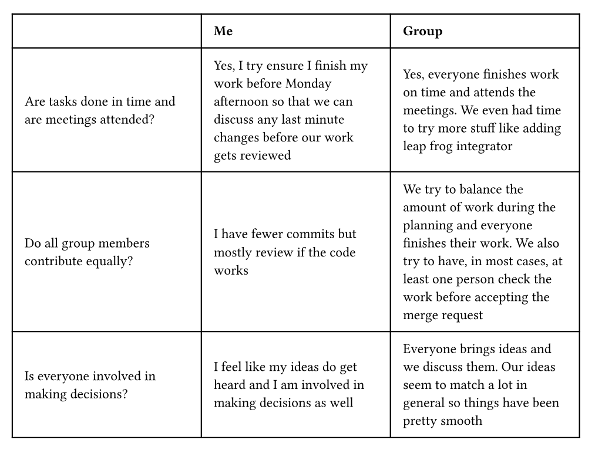

Noa's reflection:
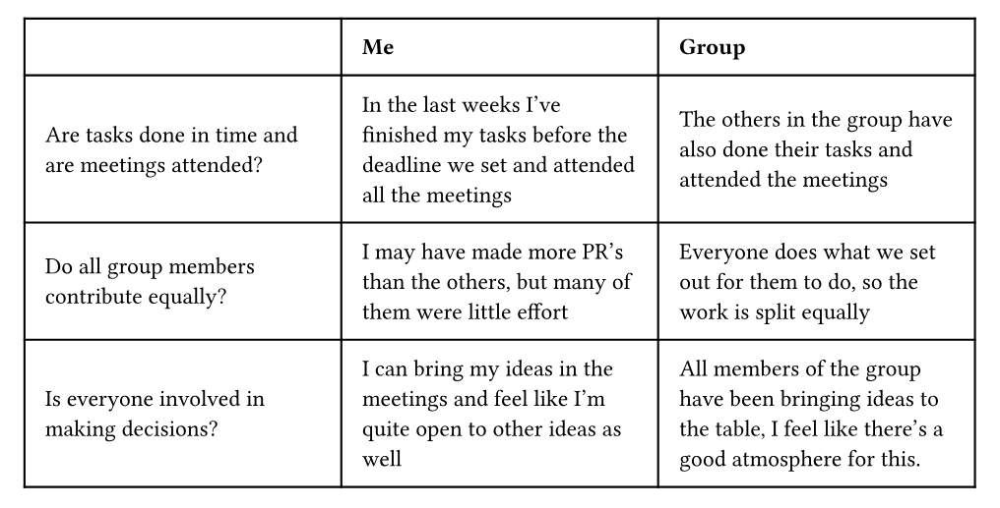

Mankrits reflection:
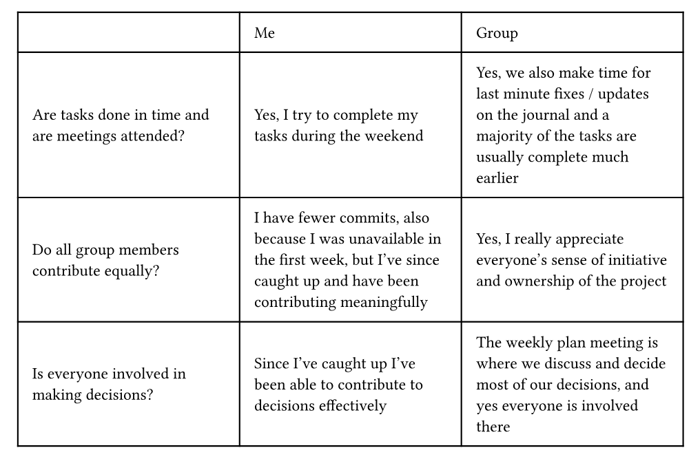

## Week 4
(due 11 March 2025, 11:00)

#### Planning

- FCC lattice (fix problems and find lattice constant etc.) @npaarts
- Make the initial velocity function for MB correct @mankritsingh
    - subtract center of mass velocity
- Show that velocities obey Maxwell-Boltzmann @mankritsingh
- Velocity rescaling @mankritsingh
- Study (one) observable @rjuyal (if others finish fast, they can help)
    - Pair correlation function
    - Diffusion
    - Pressure
    - Specific heat
- Profiling @npaarts
- Improve plots @rjuyal
    - Labels for axes
    - Time instead of timesteps on the axis
    - Time in animation title

#### Progress report

@mankritsingh \
I worked on initialising velocity to Maxwell-Boltzmann distribution in Merge Request: !27 \
Then, I worked on the periodic rescaling of the velocities for target temperature in !28 and !33 \
Also reviewed Merge Requests.

Plot of velocity distribution and Maxwell-Boltzmann distribution: \
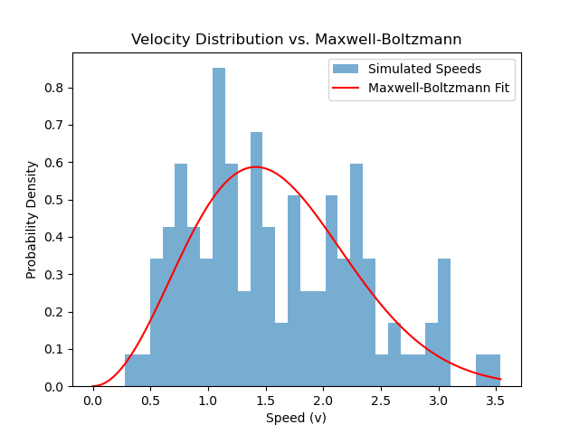

Temperature is updated periodically and error after equilibrium is noted as follows: \
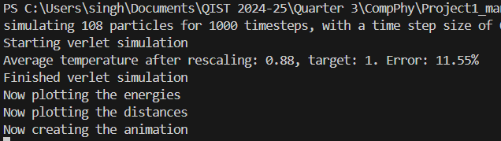

Since rescaling requires convergence, the logic we have used is this: rescale after every "equilibrium_steps" timesteps in case the current temperature is outside the "temperature_tolerance". Once the temperature is not rescaled for "equilibrium_stable_check" number of times, we stop rescaling for all future timesteps. All the quoted quantities can be varied through the configuration file.

@rjuyal 


I worked on implementing the functions for the observables(!32) and reviewed merge requests. 


Comparing observable to literature:


Pair Correlation \
Using the values provided by the Computational Physics book by J.M. Thijssen, for $\rho = 1.06$, 500 particles and temperature = 1, we get: \
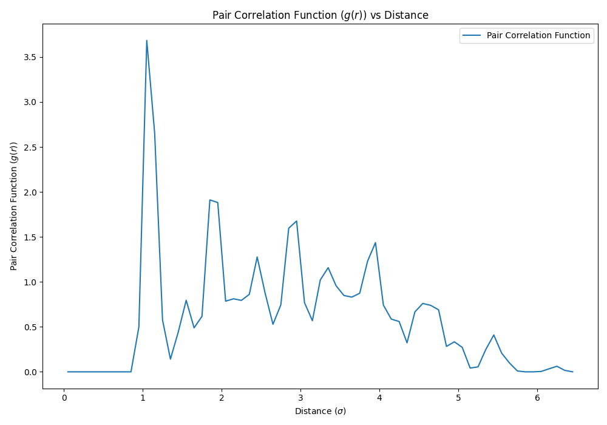  \
This has a similar shape to the graph provided in the book but the x axis and y values are quite different: \
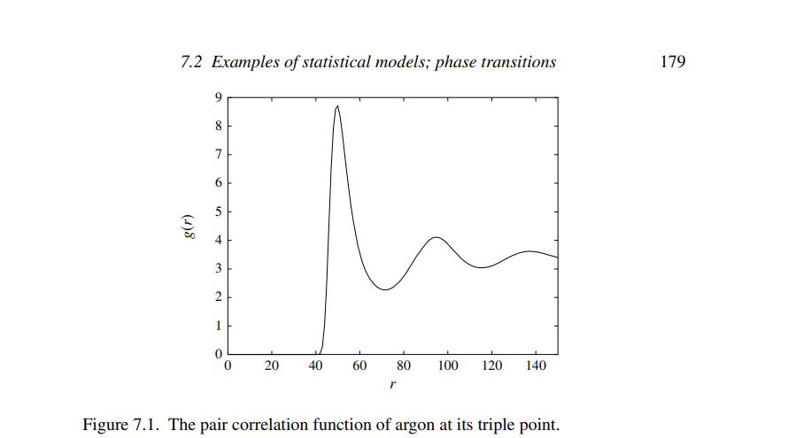 

Mean Square Displacement: \
For the same values as above, we get the mean square distance graph to increase suddenly at the beginning and then plateaus which is the expected behaviour for solids. \
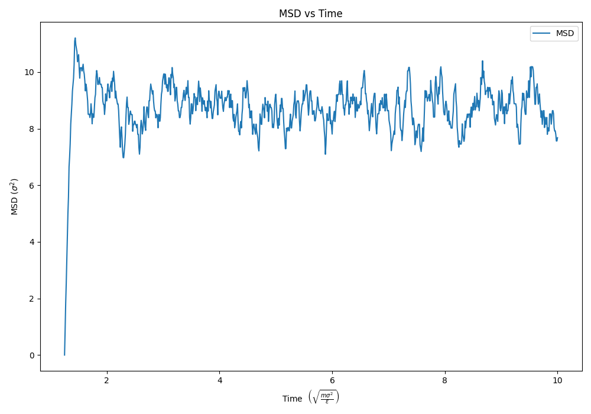 

Specific Heat: \
For the same values as above, we get the specific heat to be 2.985689304164882 which is pretty close to what is predicted by Dulong-Petit law($3k_B T = 3$).

Compressability: \
For this we faced a lot of errors. Using $\rho$ as 0.88 and 500 particles from the values provided by the same book:
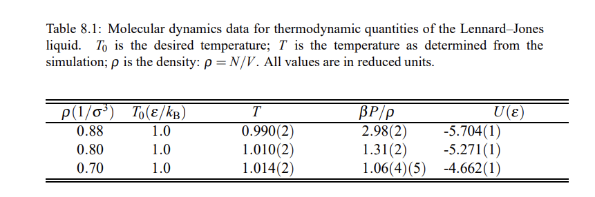 \
We get 0.16723744434606735 which is very far from what is expected. For some reason, it changes quite a lot. When we tried 108 particles and slightly different density (~0.86) we got the compressability as ~ 2.18.

@npaarts

I started by fixing the problems we found in the fcc lattice initialisation code we discussed after the lecture.
This didn't take too long which was good because I had a lot to do and not that much time.

I did find a bug which got into the program with respect to the caching, so I fixed it in ff6bd600f703cfb403e6fd0bb5683d4ffb30af79.

I also worked on profiling the code we created, for this I used pyflame, since I've used flamegraphs before for
profiling code and think they are a good visualisation method.
In flamegraphs the time spent in a certain function block is displayed as a block where the width is representative for
the time spent. If a block is on top of another block this means that it was called from the block it's on.
If you open the file in a compatible viewer you should be able to click the blocks to zoom in.

Before I started optimising I ran the profiler to see that a lot of time is spent creating the animation.
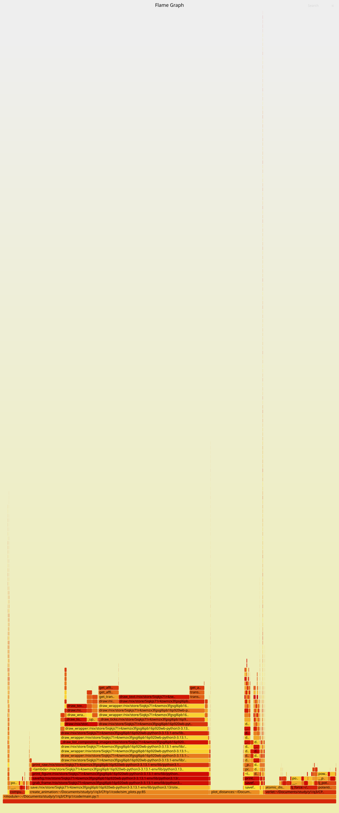 \
I also noticed that a suprising amount of time was spent in `plot_distances`.
When I took a look at [the code](https://gitlab.kwant-project.org/computational_physics/projects/Project1_mankritsingh_npaarts_rjuyal/-/blob/ff6bd600f703cfb403e6fd0bb5683d4ffb30af79/code/sim_plots.py#L46-L82)
I could see that we were creating a numpy array from the distance list inside of the loop.
```python
    for i in range(0, len(distance_list[0])):
        if i == particle:
            continue
        plt.plot(time, np.array(distance_list)[
                 :, particle, i], label=f"Particle {i}")
```
Due to how memory is laid out differently by python and numpy this was creating a lot of overhead,
I decided to create a numpy array only once and then used that one in the loop:
```python
    reduced = np.array(distance_list)[:, particle, :]
    for i in range(0, len(reduced[0])):
        if i == particle:
            continue
        plt.plot(time, reduced[:, i], label=f"Particle {i}")
```
This improved the time used by the `plot_distances` function body itself significantly.
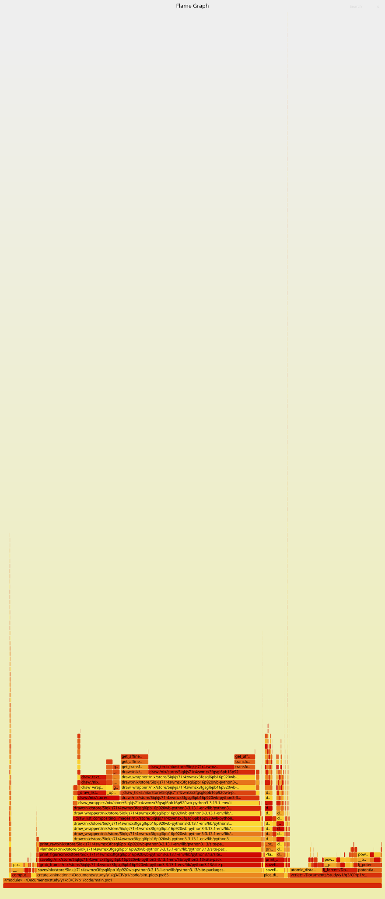 \
The biggest cost function that's left and in our control is `atomic_distances`. 
It already uses numpy for most things, but it's still taking quite long.
You can see [the code](https://gitlab.kwant-project.org/computational_physics/projects/Project1_mankritsingh_npaarts_rjuyal/-/blob/1eafc7e61657c99c6ad3c082fdd975e312defab9/code/simulators.py#L356-L396), but the important part
is
```python
    central_x, other_x = np.meshgrid(pos[:, 0], pos[:, 0])
    central_y, other_y = np.meshgrid(pos[:, 1], pos[:, 1])
    central_z, other_z = np.meshgrid(pos[:, 2], pos[:, 2])
    # moving to the coordinate frame of the central particle
    # to find the closest position of those around
    x_dist = (central_x - other_x + box_dim[0] / 2) % box_dim[0] - box_dim[0] / 2
    y_dist = (central_y - other_y + box_dim[1] / 2) % box_dim[1] - box_dim[1] / 2
    z_dist = (central_z - other_z + box_dim[2] / 2) % box_dim[2] - box_dim[2] / 2

    relative_positions = np.stack([x_dist, y_dist, z_dist])
    distances = np.ma.masked_values(
        np.sqrt(x_dist * x_dist + y_dist * y_dist + z_dist * z_dist),
        0.0,
        rtol=1e-60,
        atol=1e-60,
    )
```
Since all these calls happened in the same function body the flamegraph didn't display them seperately,
to find out what the slow part was I took each of the three main blocks out into a seperate function
and created another flamegraph. What I found was that the `x_dist`, `y_dist` and `z_dist` calls
were taking the longest by far, these are already using fully vectorised numpy functions so we
can't optimise them any more. I did however see a small improvement by only indexing `pos` once
for each of the central/other calls, and going further and using `np.unstack` for it.
This produced [the new code](https://gitlab.kwant-project.org/computational_physics/projects/Project1_mankritsingh_npaarts_rjuyal/-/blob/0eb62f926c9b96821cf6ffeac704a588d66ee41d/code/simulators.py#L356-L398) and a new flamegraph.
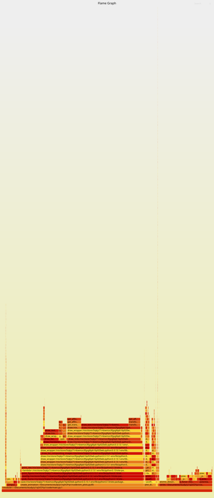 \
No more easy performance wins are visible anymore, nearly all of the execution time is inside of
matplotlib or numpy.

## Week 5
(due 18 March 2025, 11:00)

#### Planning

Mankrit:
- split out the simulator step to reduce code duplication
- export printed observables/data in the terminal to a csv file that can be useful for the final report
- think of what we will finally show in the report (vary which parameters or compare simulators etc.)

Noa:
- Add progress bars to enable larger scale simulations
- Possibly get cupy working for faster sims on CUDA
- Add a scipy integrator for correct baseline to compare against
- Try to improve memory usage

Ragi:
- Make adjustments to improve plot quality of observables.
- Compute the errors for observables

#### Progress report

@mankritsingh \
I worked on cleaning up of the simulator code so that it is more logically structured in !38. We had a lot of duplicate code with velocity rescaling etc. for our simulators (verlet, leapfrog and euler) which was getting hard to keep a track of, and it is now much cleaner. 

Then, I worked on exporting parameters to a CSV file in !39 (and also printing out the parameters cleanly) which should assist us with the report writing and presenting. 

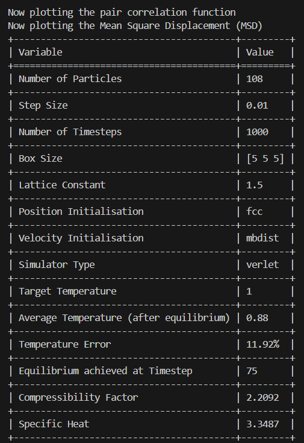 

Lastly spent a bit of time on error calculations (discussions/debugging). 

Regarding the final report, we currently plan to do the following:
- Compare different temperatures for the Argon simulation, do we see a phase transition-like trend in our specific heat?
- Compare simulators for the same set of parameters - verlet, leapfrog and euler
- Observables noted would be specific heat and MSD
- Add some metrics on the performance of the simulation.

@rjuyal \
I worked on computing the error for specific heat and adding the scipy integrator(!40). 
When using the data given: \
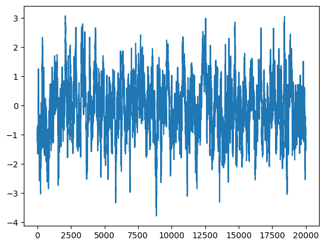 \
Using data blocking we get: Final error: 0.05950864858496442 \
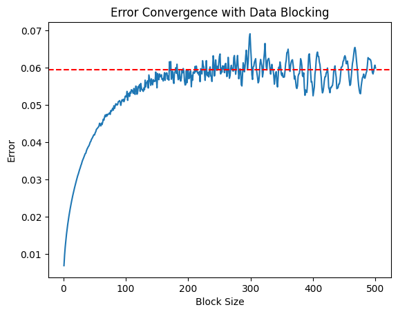 \
And using autocorrelation we get: \
Estimated correlation time τ: 44.052 \
Estimated error using autocorrelation: 0.065 \
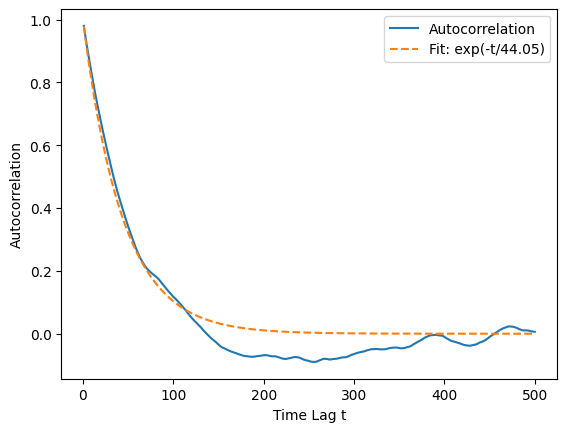 

@npaarts \
I started by making all the simulations pre-allocate a significant part their memory by creating numpy arrays at the
beginning. This ment that we wouldn't have to copy it all near the end of the simulations.
We also decided that we wanted progress bars for longer running processes, this way we could estimate how long
the simulation would take and get a sense of progress.

I wanted to add the integrator from scipy as well, but a different course we're all following had a broken homework
so @rjuyal picked this up for me so I had time to go to the TA and try to find out how to make it work for the class.
I am very thankful for this.

I don't know if I'll have done it when you're looking at this but I'm planning on removing the `distance_list` from the
various simulator codes, this would improve the memory consumption by an order of `O(n)` (since its `O(n*n*tsteps)` now)
so we would be able to run larger simulations for the report.

We compute specific heat as 2.7465 and using block bootstrap we get 2.7223 ± 0.1932

## Final Report
The final report for this project can be found at 


## Reminder final deadline

The deadline for project 1 is **25 March, 23:59**. By then, you must have uploaded the report to the repository, and the repository must contain the latest version of the code.
